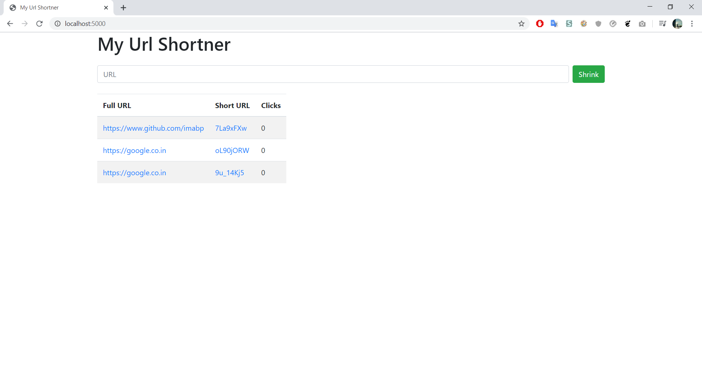

# MY LINK MANAGER 

My_URL Shortner helps you to shorten the links and is very handy if you deal with lot of links in your daily life. Created using NodeJS, ExpressJS, and Mongoose

# Local Setup
### Dependencies
1. ExpressJS 
2. EJS
3. Mongoose
4. ShortID -> generates unique identifier
<code>
 npm i express ejs mongoose shortid
</code>

### Dev Dependencies
 1. Nodemon - used for live server.
 <code>npm -i --save-dev nodemon</code>
 
# Screenshot

### Connect with me on <a href="https://www.linkedin.com/in/imabp">LinkedIn</a>
